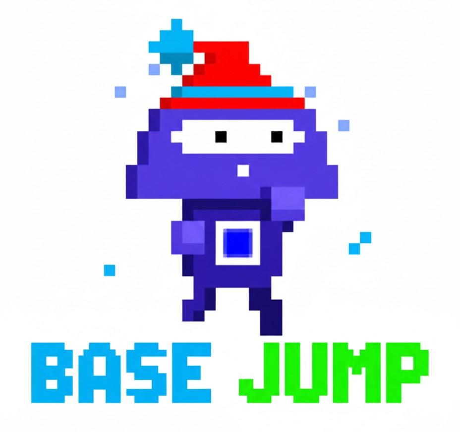

# 🎮 Base Jump

<div align="center">



**The Ultimate Vertical Jumping Adventure on Base Blockchain**

[](https://opensource.org/licenses/MIT)
[](https://base.org)
[](https://farcaster.xyz)

[Play Now](https://base-jump-five.vercel.app) | [Join Waitlist](#web-version) | [Documentation](#features)

</div>

---

## 🌟 Overview

**Base Jump** is an addictive vertical platform jumper that combines fast-paced arcade action with blockchain rewards. Jump through platforms, collect candy, dodge enemies, and compete for the top spot on the leaderboard—all while earning real token rewards on the Base blockchain!

### 🎯 Game Concept

Control your character as they automatically jump upward through an endless vertical course. Navigate through different platform types, collect delicious candy for points, avoid deadly enemies, and survive as long as possible to achieve the highest score!

---

## 🎮 Gameplay Features

### 🪂 Core Mechanics

- **Auto-Jumping Character**: Your player automatically bounces upward
- **Tilt & Touch Controls**: 
  - **Tilt Mode**: Lean your device left/right to move
  - **Button Mode**: Tap left/right arrows for precise control
- **Vertical Scrolling**: The world moves down as you ascend
- **Physics-Based Movement**: Realistic bounce and gravity effects

### 🎪 Platform Types

1. **Normal Platforms** 🟦
   - Standard platforms you can land on safely
   - Most common type in early game

2. **Destructive Platforms** 🔴
   - Break after one landing
   - Disappear after you touch them
   - Increase in frequency as difficulty rises

3. **Invisible Platforms** 👻
   - Semi-transparent and harder to see
   - Move horizontally back and forth
   - Speed increases with game difficulty
   - Require precise timing to land on

### 🍬 Collectibles & Obstacles

- **Candy/Food Items** 🍬
  - Scattered throughout the level
  - Collect for instant points and score boost
  - Trigger super jump effect for extra height
  - Different candy types with varied visuals

- **Enemies** 👾
  - Two enemy types patrol the skies
  - Shoot missiles after 5-second warm-up
  - Contact with enemy or missile = game over
  - Animated sprites with attack patterns

### 📊 Difficulty Progression

The game features dynamic difficulty scaling:

- **Easy** (Score 0-50): Mostly normal platforms, slow enemies
- **Normal** (Score 51-100): Mixed platform types, faster movement
- **Hard** (Score 101-200): More destructive/invisible platforms
- **Extreme** (Score 200+): Maximum challenge, fast-moving obstacles

### 🎵 Audio & Haptics

- Background music with mute toggle
- Sound effects for:
  - Jumping
  - Collecting candy
  - Game over
- Haptic feedback (vibration) on mobile devices

---

## 🏆 Game Modes & Features

### 🎯 Classic Mode

- **Unlimited Play**: Play as many games as you want
- **Local Best Score**: Track your personal record
- **Practice Mode**: Perfect your skills

### ⛓️ Blockchain Mode (Farcaster Mini App)

- **Gift Box Rewards**: Earn crypto tokens through gameplay
- **Game Restrictions**: 3 gift boxes every 12 hours
- **Token Rewards**: Claim DEGEN, NOICE, and PEPE tokens
- **Leaderboard Integration**: Compete globally with verified scores
- **Auto-Reset Timer**: Gift box claims reset every 12 hours

### 📈 Scoring System

**Dual Score Tracking:**

1. **Current Season Score** (`currentSeasonScore`)
   - Updates with every game played
   - Determines your current leaderboard ranking
   - Used for season-based rewards

2. **All-Time High (ATH)** (`score`)
   - Your best score ever achieved
   - Only updates when you beat your previous record
   - Displayed alongside season score on leaderboards

**Score Calculation:**
- Base points for surviving
- Bonus points for collecting candy
- Height-based scoring
- Combo multipliers for consecutive candy collection

---

## 🔗 Blockchain Integration

### Base Network Features

Built on **Base** (Ethereum L2) for:
- ⚡ Fast transaction speeds
- 💰 Low gas fees
- 🔐 Ethereum-level security
- 🌐 Wide ecosystem compatibility

### Smart Contracts

#### BaseJump Contract
```solidity
// Core features:
- Game session management (3 gift boxes per 12-hour period)
- Gift box token distribution (DEGEN, NOICE, PEPE)
- Signature-based verification
- Anti-replay attack protection
```

**Contract Functions:**

**MiniGame Contract (0x345BC05608DA88A755af6705149bEd37118fb31C):**
- `startGame(uint256 fid)`: Initialize new game session for player
- `storeScore(uint256 score)`: Submit and verify game score
- `getUserGameInfo(address user)`: Get user game information

**BaseJump Contract (0xd137015EE799D0224AF58940D21d0684B32c3506):**
- `claimTokenReward(address token, uint256 amount, bytes signature)`: Claim gift box rewards
- `getUserGameInfo(address user)`: Check remaining games and cooldown status

**Contract Features:**
- Period-based game limits (12-hour windows)
- Multiple ERC20 token support for rewards
- Secure signature verification from game server
- Farcaster ID (FID) integration for player identity

### 🎁 Gift Box Reward System

Players can earn various crypto tokens through the Gift Box system:

| Token | Symbol | Reward Range | Rarity |
|-------|--------|--------------|--------|
| DEGEN | $DEGEN | 100 - 500 tokens | Common |
| NOICE | $NOICE | 50 - 200 tokens | Uncommon |
| PEPE | $PEPE | 10,000 - 50,000 tokens | Rare |

**How It Works:**
- 🎁 **3 Gift Boxes per 12-hour period**
- 🎯 **Score-based probability**: Higher scores = better rewards!
- 🎲 **Random token selection**: Each token has equal chance when you win
- 🔒 **Smart contract secured**: All claims verified on-chain
- ⏰ **Auto-reset timer**: Counter resets every 12 hours

**Probability by Score:**

| Your Score | Win Chance | Better Luck Chance |
|------------|------------|-------------------|
| < 500 | 10% 🟡 | 90% |
| 500-999 | 30% 🟠 | 70% |
| 1,000-1,999 | 50% 🟢 | 50% |
| 2,000-2,999 | 70% 🔵 | 30% |
| 3,000-4,999 | 80% 🟣 | 20% |
| 5,000+ | 90% 🏆 | 10% |

**Reward Mechanics:**
- Gift box appears when you beat your high score
- Open the box to reveal your reward
- Claim tokens instantly to your wallet
- Track all earnings in your stats page

---

## 🏅 Leaderboard System

### Global Rankings

- Real-time leaderboard updates
- Display top players worldwide
- Show both current season and ATH scores
- Profile pictures from Farcaster

### Leaderboard Types

1. **Current Season Leaderboard**
   - Rankings based on `currentSeasonScore`
   - Resets periodically for fair competition
   - Season rewards distributed to top players

2. **All-Time High Leaderboard**
   - Historical best scores
   - Hall of fame for legendary players
   - Never resets

### Player Stats Display

```
🏆 Rank: #42
👤 Username: @player123
⭐ Season Score: 1,247
🎯 All-Time Best: 2,891
```

---

## 🎨 NFT Features (Coming Soon)

### Planned NFT Integration

- **NFT Gallery**: View and manage your Base Jump NFTs
- **Character Customization**: Customize player appearance with NFT traits
- **Rarity System**: Collect common, rare, epic, and legendary NFTs
- **Power-ups**: NFTs that grant in-game advantages
- **Trading**: Trade NFTs with other players

---

## 🌐 Platform Support

### Farcaster Mini App

**Primary Platform:**
- Native integration with Farcaster
- Seamless wallet connection
- Social features and sharing
- Verified player identities

**Launch Instructions:**
1. Open Farcaster mobile app
2. Navigate to Mini Apps
3. Search for "Base Jump"
4. Tap to launch and play!

### Web Version (Waitlist)

**Coming Soon!** 🚀

Join our waitlist to be the first to play on the web:

**Features:**
- Browser-based gameplay
- Desktop and mobile support
- Wallet connect with MetaMask, Coinbase Wallet, WalletConnect
- Cross-platform progress sync

**How to Join Waitlist:**
1. Visit [base-jump-five.vercel.app](https://base-jump-five.vercel.app)
2. Click "Connect Wallet"
3. Choose your wallet (MetaMask/WalletConnect)
4. Enter your name
5. Submit to join the waitlist

**Requirements:**
- Must have Base network in your wallet
- Automatic chain switching if on wrong network
- Only Base blockchain supported

---

## 🛠️ Technical Stack

### Frontend

- **Framework**: Next.js 14 (React)
- **Game Engine**: Phaser 3 (Canvas-based 2D game engine)
- **Styling**: Tailwind CSS
- **Animations**: Framer Motion
- **State Management**: React Hooks

### Backend

- **API Routes**: Next.js API Routes
- **Database**: MongoDB (player data, scores, leaderboards)
- **Cache**: Upstash Redis (fast data access)
- **Authentication**: Custom signature-based system

### Blockchain

- **Network**: Base (Ethereum L2)
- **Wallet Integration**: 
  - Wagmi (React Hooks for Ethereum)
  - Reown AppKit (WalletConnect v2)
  - Farcaster Mini App Connector
- **Smart Contracts**: Solidity
- **Libraries**: ethers.js, viem

### Infrastructure

- **Hosting**: Vercel
- **Chain RPC**: Base RPC endpoints
- **IPFS**: (Planned for NFT metadata)

---

## 📦 Installation & Setup

### Prerequisites

```bash
node >= 18.0.0
pnpm >= 8.0.0
```

### Environment Variables

Create a `.env.local` file:

```env
# Database
MONGODB_URI=your_mongodb_connection_string

# Smart Contract Addresses
NEXT_PUBLIC_BASE_JUMP_ADDRESS=0xYourBaseJumpContractAddress

# Token Contract Addresses (Base Network)
NEXT_PUBLIC_DEGEN_TOKEN_ADDRESS=0x4ed4e862860bed51a9570b96d89af5e1b0efefed
NEXT_PUBLIC_NOICE_TOKEN_ADDRESS=0x9cb41fd9dc6891bae8187029461bfaadf6cc0c69
NEXT_PUBLIC_PEPE_TOKEN_ADDRESS=0x52b492a33e447cdb854c7fc19f1e57e8bfa1777d

# API Security
API_SECRET_KEY=your_api_secret_key
NEXT_PUBLIC_API_SECRET_KEY=your_public_api_key
SERVER_PRIVATE_KEY=your_server_private_key_for_signing

# Wallet Connect
NEXT_PUBLIC_REOWN_PROJECT_ID=your_reown_project_id

# App URL
NEXT_PUBLIC_URL=http://localhost:3000

# Redis (Optional)
KV_REST_API_URL=your_redis_url
KV_REST_API_TOKEN=your_redis_token
```

### Installation

```bash
# Clone the repository
git clone https://github.com/your-username/base-jump.git
cd base-jump

# Install dependencies
pnpm install

# Run development server
pnpm dev
```

Visit `http://localhost:3000` to play locally!

### Building for Production

```bash
# Build the application
pnpm build

# Start production server
pnpm start
```

---

## 🎯 API Endpoints

### Game APIs

| Endpoint | Method | Description |
|----------|--------|-------------|
| `/api/start-game` | POST | Start a new game session |
| `/api/submit-score` | POST | Submit final game score |
| `/api/leaderboard` | GET | Fetch leaderboard data |
| `/api/game-leaderboard` | GET | Game-specific leaderboard |
| `/api/ath-leaderboard` | GET | All-time high scores |
| `/api/user-stats` | GET | Individual player statistics |

### Gift Box APIs

| Endpoint | Method | Description |
|----------|--------|-------------|
| `/api/claim-gift-box` | POST | Claim a gift box and get token reward |
| `/api/claim-gift-box?stats=true` | GET | Check remaining claims and stats |
| `/api/claim-gift-box?userAddress=0x...&fid=123` | GET | Get user's gift box availability |

### Waitlist APIs

| Endpoint | Method | Description |
|----------|--------|-------------|
| `/api/waitlist` | POST | Join web version waitlist |
| `/api/waitlist?address=0x...` | GET | Check if address is on waitlist |
| `/api/waitlist` | GET | Get total waitlist count |

### Admin APIs

| Endpoint | Method | Description |
|----------|--------|-------------|
| `/api/total-players` | GET | Total registered players |
| `/api/faucet-stats` | GET | Faucet usage statistics |

---

## 🔐 Security Features

### Authentication System

- **Signature-Based Auth**: All API calls require cryptographic signatures
- **Replay Attack Prevention**: One-time use signatures
- **Rate Limiting**: Prevent API abuse
- **Secure Key Storage**: Environment-based secret management

### Smart Contract Security

- **Audited Contracts**: (Recommended before mainnet)
- **Access Control**: Owner-only admin functions
- **Signature Verification**: Server-signed reward claims
- **Re-entrancy Protection**: Standard OpenZeppelin patterns

### Data Protection

- **Encrypted Storage**: Sensitive data encryption
- **HTTPS Only**: Secure data transmission
- **Input Validation**: All user inputs sanitized
- **SQL Injection Protection**: Parameterized queries

---

## 🎨 Assets & Credits

### Graphics

- Custom pixel art characters and platforms
- Animated sprites for enemies and players
- Platform textures (normal, destructive, invisible)
- Candy/food collectible sprites

### Audio

| Sound | File | Purpose |
|-------|------|---------|
| Background Music | `background-music.mp3` | Main game loop |
| Jump Sound | `jumpSound.mp3` | Player jump action |
| Collect Sound | `eatSound.mp3` | Candy collection |
| Game Over | `gameOverSound.mp3` | End game |
| Click | `click.wav` | UI interactions |

### Fonts & UI

- Custom gradient backgrounds
- Glass-morphism UI elements
- Responsive mobile-first design

---

## 🤝 Contributing

We welcome contributions! Here's how you can help:

### Ways to Contribute

1. 🐛 **Bug Reports**: Found a bug? Open an issue
2. 💡 **Feature Requests**: Have an idea? We'd love to hear it
3. 🔧 **Code Contributions**: Submit PRs for improvements
4. 📖 **Documentation**: Help improve our docs
5. 🎨 **Design**: Create assets or UI improvements

### Development Guidelines

```bash
# Fork the repository
# Create a feature branch
git checkout -b feature/amazing-feature

# Make your changes
# Commit with descriptive messages
git commit -m "Add amazing feature"

# Push to your fork
git push origin feature/amazing-feature

# Open a Pull Request
```

---

## 📊 Project Statistics

- **Total Lines of Code**: ~15,000+
- **Components**: 25+
- **API Routes**: 17+
- **Smart Contracts**: 1 (BaseJump.sol)
- **Supported Chains**: Base (Ethereum L2)
- **Supported Wallets**: MetaMask, Coinbase, WalletConnect, Farcaster
- **Reward Tokens**: 3 (DEGEN, NOICE, PEPE)
- **Gift Boxes**: 3 per 12-hour period

---

## 🗺️ Roadmap

### Q1 2025
- [x] Core game mechanics
- [x] Farcaster Mini App integration
- [x] Blockchain reward system
- [x] Leaderboard system
- [ ] Web version launch
- [ ] Public beta testing

### Q2 2025
- [ ] NFT integration
- [ ] Character customization
- [ ] Multi-level campaigns
- [ ] Tournament mode
- [ ] Mobile app (iOS/Android)

### Q3 2025
- [ ] Social features (guilds, friends)
- [ ] Seasonal events
- [ ] Additional blockchain networks
- [ ] Marketplace for NFTs
- [ ] Staking mechanism

### Q4 2025
- [ ] Esports tournaments
- [ ] Sponsored events
- [ ] Creator tools
- [ ] API for third-party integrations

---

## 📄 License

This project is licensed under the **MIT License** - see the [LICENSE](LICENSE) file for details.

---

## 📞 Support & Community

### Get Help

- **Discord**: [Join our server](https://discord.gg/basejump)
- **Twitter/X**: [@BaseJumpGame](https://twitter.com/basejumpgame)
- **Email**: support@basejump.game
- **Documentation**: [docs.basejump.game](https://docs.basejump.game)

### Report Issues

Found a bug? [Open an issue](https://github.com/your-username/base-jump/issues)

### Stay Updated

- 🐦 Follow us on Twitter for updates
- 📬 Subscribe to our newsletter
- 🎮 Join the Farcaster community

---

## 🙏 Acknowledgments

Special thanks to:

- **Base** team for the amazing L2 infrastructure
- **Farcaster** for Mini App platform and tools
- **Phaser** community for the game engine
- **OpenZeppelin** for secure smart contract libraries
- **Vercel** for seamless deployment
- All our early testers and community members

---

## 🌟 Fun Facts

- 🎮 Average game session: 2-3 minutes
- 🏆 Highest score recorded: 2,891 points
- 🍬 Total candy collected: 1,000,000+
- 👥 Active players: Growing daily!
- ⚡ Fastest completion: 45 seconds (hardcore mode)
- 🎁 Gift boxes opened: Track yours in stats!
- 💰 Tokens distributed: DEGEN, NOICE & PEPE on Base

---

<div align="center">

### 🎮 Ready to Jump?

**[Play Now on Farcaster](https://farcaster.xyz/~/mini-apps/launch?domain=base-jump-five.vercel.app)** | **[Join Web Waitlist](https://base-jump-five.vercel.app)**

Made with ❤️ by the Base Jump Team

⭐ **Star us on GitHub if you enjoy the game!** ⭐

</div>

# Base_Tower
